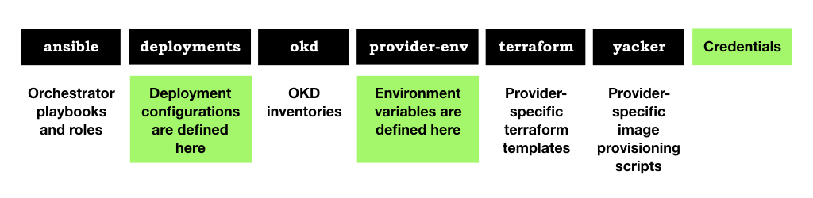

############
Architecture
############

.. highlight:: none

The orchestrator is a utility that is designed to simplify the creation
(and removal) of RedHat OKD clusters. It introduces a number of
*concepts* and accomplishes it through the use of a number of *components*.

The utility is in an early stage of development and is evolving rapidly.
The goal is to provide a simple and rapid and automated means of instantiating
a RedHat OKD-based compute cluster with minimal effort.

***********
The Concept
***********

The orchestrator is designed to allow the deployment of **Clusters** and their
**Bastion** control servers with minimal effort from the comfort of a
development laptop.

Creation and destruction is handled by logic managed from within
two Python command-line modules; ``create.py`` and ``destroy.py``. The modules
call upon a number of underlying processes (essentially carried out by
**Terraform** and **Ansible**) in order to create and destroy your hardware.

Using a convenient container image (or your own) you are able to
create and manage clusters across a number of cloud providers using
simple commands.

************
Organisation
************

The orchestrator implementation is distributed over a number of directories,
which we'll explore later.

It consists of the following components you're encouraged
to adopt and edit (illustrated in green above): -

*   **Credentials** and other sensitive variables
*   **Deployment configuration** files
*   **Provider Variables**

Additionally, the following *built-in* components are used to create
machine images and instantiate hardware: -

*   Ansible **playbooks**
*   **Yacker** templates
*   **Terraform** templates
*   A **Jinja2** rendering process
*   A **create** utility
*   A **destroy** utility

We'll briefly explore each component below.

Ansible Playbooks
=================

Located in the ``ansible`` directory, a number of built-in playbooks,
managed by the ``create`` and ``destroy`` utilities (described below),
provide value-added facilities including the configuration of the bastion
machine, and pre and post OKD playbooks used to manage SSL certificate
generation and the installation of additional software like the ACME
SSL controller.

Deployment configurations
=========================

Located in the ``deployments`` directory, a **Deployment** *describes* your
cluster; providing a high-level description of the cluster
hardware and software requirements that include the number and
types of the compute instances used for your OKD nodes and the
settings for the OKD software.

The **deployment** is defined in a `YAML`_ file called ``configuration.yaml``.

You can have more than one deployment configuration, each describing a separate
OKD cluster.

Deployment files are located in sub-directories of the ``deployments``
directory.

Deployment directories are also used to house your own SSL certificates
if you have them. You can, of course, use certbot/Let's Encrypt to
automatically create them for your site if you wish.

Further details of the deployment configuration can be found in the document
:doc:`anatomy-of-a-deployment-configuration`.

    You can provide a path to your own ("out-of town") deployment configuration
    by providing a path the parent of your own deployments directory in the
    ``TF_VAR_deployments_directory`` environment variable.

.. _YAML: http://yaml.org

Provider Variables
==================

Located in the ``provider-env`` directory, a number of provider-specific
shell-scripts act as templates for the environment variables you are required
to provide for the OKD Orchestrator.

You typically copy a template and name it ``setenv.sh`` and then adjust the
content as described. You should find built-in templates for Amazon and Google
cloud providers.

Terraform Templates
===================

In the ``terraform`` directory, these files, many of which are
created automatically based on the content of your deployment configuration,
provide provisioning instructions for the HashiCorp Terraform tool.

`Terraform`_ is used to create and destroy the OKD cluster hardware.
It is a form of IaC tool that automates the construction of cloud infrastructure
including additional volumes, networks, subnets and security groups.

It's language is declarative, meaning that you simply need to describe what is
connected to what and it manages the creation of objects and their connections.

Once you've described your cluster you have access to Terraform commands like
**apply** to build the cluster and **destroy** to delete it.

.. _terraform: https://www.terraform.io

Yacker scripts
==============

In the ``yacker/3.11`` directory, these files, typically of no particular
interest to you, provides provisioning instructions for OKD-compliant base
images for each cloud provider.

`Yacker`_ is used to create base images for the compute instances.
It is a YAML wrapper around **Packer**. It is driven by YAML files that
describe installation instructions that are executed on a base Operating System
like CentOS in order to form an OS and utilities suitable for OKD.

The YAML *template* files are organised in directories relating to OKD
version and cloud provider. For example there is an AWS *bastion image*
template for OKD 3.11 in ``yacker/3.11/aws``.

**Yacker** is employed once per OKD release and cloud provider combination.
The images produced are suitable for any cluster for the given OKD release on
that cloud provider.

.. _yacker: https://pypi.org/project/matildapeak-yacker/

Credentials
===========

Finally, in the root of the project, there are a number of files you need
to provide, depending on the cloud provider your're deploying into.
There's always the public and private files for the SSH key that's used to
create and connect to physical machines. You may also be required to put
other files in the project root. One example is the Google Compute Engine
(GCE) credentials file if you're deploying to GCE. This is a JSON file
you douwnload form your Google account.

None of these files are committed to revision control of course, you have
to provide them and keep them local.

*****
Tools
*****

The Create Utility
==================

Located in the root of the OKD Orchestrator project, ``create.py`` is the
simplified utility wrapper that acts as the creator of your cluster and
interpreter of your deployment configuration.

It provides a simplified interface that allows you to create a cluster (and
then install the OKD software) with a command like::

    $ ./create.py --cluster

The Destroy Utility
===================

A complement of ``create.py``, ``destroy.py``, found in the root of
the OKD orchestrator project, is used to quickly and conveniently
tear-down your OKD cluster once you no longer need it.

``destroy`` relies on cluster hardware state information that's automatically
generated by the Terraform process employed by the ``create.py`` utility.

This state can be local (on your development machine) or locked and managed
for team access as defined by your configuration using a combination of S3
object storage and Dynamo database services that you setup and are provided
by AWS.

See :doc:`anatomy-of-a-deployment-configuration` for further details.

.. _s3: https://aws.amazon.com/s3/
.. _dynamo: https://aws.amazon.com/dynamodb/

*************************
Jinja2 Templating Process
*************************

A file rendering process based on the `Jinja2`_ templating language
is used by the ``create`` utility to dynamically render Terraform and
Ansible inventory files based on the content of your
**deployment configuration**.

It is how your names and properties in your configuration get into your
terraform and inventory files but it's execution and design is beyond the
scope of this documentation.

.. _jinja2: http://jinja.pocoo.org/docs/2.10/
