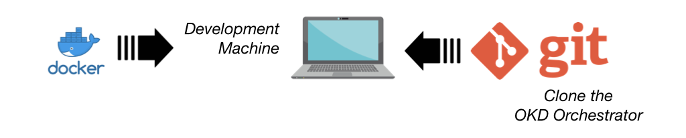

###########
Orientation
###########

Here we introduce you to the OKD orchestrator, guide you through its use and
walk through one of the built-in *standard* AWS-based tutorial files. [#f0]_

Introduction
^^^^^^^^^^^^

The OKD Orchestrator is a utility designed to simplify simple [#f1]_
RedHat `OKD`_ platform installations.

The OKD Orchestrator is an `OpenRiskNet`_ funded project [#f3]_ and the
orchestrator has a number of roles: -

-   **Definition** of a deployment
-   **Compilation** of base operating system machine images
-   **Provisioning** of cloud-based compute instances
-   **Deployment** of the OKD platform

It achieves this through the use of `Packer`_, `Terraform`_ and `Ansible`_,
all managed by a pair of simple `Python`_-based **command-line utilities**
and a high-level **configuration file**.

    We are not going to discuss Packer, Terraform or Ansible in this
    orientation. It might be valuable to understand their roles as
    *infrastructure as code* tools but you don't need to as the OKD
    Orchestrator wraps their execution up for you.

If you want to recreate this orientation's deployment on AWS
you will need: -

#.  An **AWS account** and SSH keypair
#.  **Git** to clone the OKD Orchestrator
#.  **Docker** to run the OKD Orchestrator in Docker
#.  **Python** (and a suitable virtual environment) to run the OKD Orchestrator
    from the command-line
#.  A **certbot/Let's encrypt account** if you want to enable
    also auto-generate SSL certificates
#.  Familiarity with the unix command-line and shell
#.  An internet connection

The more detailed guide that starts with the :doc:`getting-started` document
should provide you with all the necessary instructions.

Why do I need the OKD Orchestrator?
===================================

You don't. You could create your own compute instances and install OKD
yourself.

The configuration of OKD is, understandably, complex. There are lots of parts
to OKD and a myriad of configuration parameters spread over pages of
some quite extensive documentation. OKD is no different
if you don't understand it then configuring it will be difficult as one
depends on the other::

    "Genius is making complex ideas simple, not making simple ideas complex."
    -- Albert Einstein

Once you've created your OKD definition (an *inventory file* in an extended-ini
or YAML format) you now have to create your compute instances.

If you've used a cloud provider's built-in tools you'll appreciate that
creating precisely what you need for the network topology can be challenging.

Each provider uses their own terms for the network components
(*security groups* in AWS, *firewalls* in GCE), which are often connected
differently (groups connect to instances in AWS but
firewalls connect to a networks in GCE).

The good news is that if you're tied to one provider for business reasons
then at least your task is reduced somewhat - there's just one learning curve
to climb.

The **OKD Orchestrator** tries compress these complexities by: -

-   Consolidating both cluster and OKD configuration definitions
    into one **human-readable configuration file**
-   Providing **simplified** *create* and *destroy** command-line utilities
    so that you can create your OKD installation and then quickly tear it down
-   Trying to make the process **cloud-agnostic** by providing built-in
    Terraform orchestration for key providers

The OKD Orchestrator also supports advanced features like customer-specific
(on-premise) or bare-metal installations and post-OKD playbooks for the
installation of additional applications (like the `ACME Controller`_
certificate provisioner)

.. _acme controller: https://github.com/tnozicka/openshift-acme
.. _ansible: https://www.ansible.com
.. _freepix: https://www.freepik.com/
.. _okd: https://www.okd.io
.. _openrisknet: https://openrisknet.org
.. _packer: https://www.packer.io
.. _python: https://www.python.org
.. _terraform: https://www.terraform.io
.. _yaml: https://yaml.org

How do I use it?
================

The orchestrator is normally executed using a Docker container launched
from within the project root of a clone (or fork) of the orchestrator
GitHub repository.

    If you are comfortable working with your own copies of the underlying tools
    (i.e. Packer and Terraform) and Python virtual environments, you can
    run the orchestrator directly from the command-line [#f2]_.

We'll explore the basics of the orchestrator by reproducing the built-in
configuration for a small AWS-based installing called
``standard-aws-frankfurt-3-11`` using the container image distribution of
the OKD orchestrator, which contains all the tools you need.

Once you have cloned (or forked) the OKD Orchestrator 4 distinct steps
are required to install OKD on a new cloud environment: -

#.  **Define** a deployment
#.  **Compiling** machine images
#.  **Provisioning** physical compute instances
#.  **Deployment** of the OKD platform

Assuming that you have a container runtime like Docker installed your
next step is to clone the OKD Orchestrator to our desktop using Git::

    $ git clone https://github.com/InformaticsMatters/okd-orchestrator.git
    $ cd okd-orchestrator

This will provide us with the *create* (and *destroy*) utility and
the example deployments including the *standard* AWS deployment we're
illustrating here and the container we'll run wil provide us with all the
additional tools including a Python environment.

As well as this high-level orientation there is a more detailed discussion
of the orchestrator that starts with the :doc:`getting-started` document.

Step 1 - DEFINE a deployment
============================

..  image:: ../images/okd-orchestrator.007.png

Deployments are defined in a `YAML`_ file in the OKD Orchestrator's
``deployments`` directory and variables required to interact with your
cloud provider setup in a ``setenv.sh`` file.

The deployment file (``configuration.yaml``) resides
in a sub-directory and allows you to define the physical and software
topology of the OKD cluster.

The environment file (``setenv.sh``) lives in the ``provider-env``
directory, where you wil find templates of required variables for the
supported cloud providers.

    A discussion of the directories and layout of the OKD Orchestrator
    can be found in the accompanying :doc:`architecture` document.

Before we orchestrate the built-in example we can spend some time exploring the
anatomy of the **deployment configuration**, the YAML file that describes
the cluster hardware you desire and the OKD software that will be installed.

..  image:: ../images/okd-orchestrator.002.png

A discussion of the deployment configuration can be found in the
:doc:`anatomy-of-a-deployment-configuration` document.

Step 2 - COMPILE a Machine Image
================================

..  image:: ../images/okd-orchestrator.008.png

In this initial step, which you'd run once for each cloud-provider
and region (depending on provider), we use *Yacker* (a YAML wrapper around
the HashiCorp Packer utility) to compile a machine image suitable for OKD.

Its role is to create an operating system (machine) image that contains
all the extra *bits* needed by OKD. [#f4]_

The compilation takes place on a temporary machine created in your
provider's network. The machine is small but may still incur a
cost depending on the cloud-provider's pricing policy.

To *compile* you simply run the ``yacker build`` command from within the
orchestrator container image::

    $ ./okdo-start.sh
    $ yacker build yacker/3.11/aws/okd.yaml
    $ yacker build yacker/3.11/aws/bastion.yaml

A detailed introduction to compiling machine images can be found in the
document :doc:`compiling-machine-images`.

Once complete the resultant **machine images** are saved in your cloud account
and illustrated in the following diagram.

The default Yacker build for AWS will build machine images for the Frankfurt
(``eu-central-1``) region.

.. _yacker: https://yacker.readthedocs.io/en/latest/

Step 3 - PROVISION the hardware
===============================

With machine images built, your next step relies on the
**deployment configuration** that you have defined.

The configuration file is used by the ``create.py`` utility's ``--cluster``
option to form the physical compute instances that will be used by OKD.

From within the OKD Orchestrator container you'd typically run the
following, which instructs the ``create`` utility to create a ``cluster``
based on the configuration directory ``standard-aws-frankfurt-3-11``::

    $ ./create.py --cluster standard-aws-frankfurt-3-11

Illustrated in the diagram below, the by-product of the provisioning
process is: -

-   A network of cloud-based **hardware**
-   An **inventory** file for use in the next stage
-   A **copy of the OKD Orchestrator** on the Bastion machine,
    which includes the deployment configuration, inventory
    and other key files

..  image:: ../images/okd-orchestrator.004.png

The orchestrator achieves this by compiling a set of Terraform templates
that represent your hardware needs and then utilises Terraform to
instantiate all the physical components required to host your
environment. This typically involves instantiating a large number of
components (networks, firewalls, machines and volumes).

The AWS cluster components for our _standard_ configuration looks
something like this: -

..  image:: ../images/okd-orchestrator.012.png

Step 4 - DEPLOY OKD
===================

With the cluster created the final step, installing the OKD platform
software, takes place on the **Bastion** machine (or Master if the Master is
also acting as a Bastion). A copy of the orchestrator, deployment
and all relevant files have been placed on it by the provisioning step.

The orchestrator exposed the address of the Bastion at the end of
the cluster instantiation, so you simply need to hop onto it and
run the final stage from there::

    $ ssh centos@<bastion-address>
    $ cd okd-orchestrator
    $ ./create.py

..  image:: ../images/okd-orchestrator.005.png

At the end of this stage your OKD platform has been installed and configured.

A built-in OKD ``admin`` user (which you are required to have) will have been
created and given the password you provided in your ``setenv.sh`` environment
file.

Deleting your cluster
=====================

We're not going to go into detail here but, once you're done with your
cluster, the OKD orchestrator comes with a handy ``destroy`` utility.

It doesn't *uninstall* OKD it simply deletes all of the cloud objects
and any volumes created created by the underlying OKD platform.
Your just need to run the following from your OKD desktop container::

    $ ./destroy.py standard-aws-frankfurt-3-11

Further reading
===============

-   `Getting started with Docker <https://www.docker.com/get-started>`_
-   `RedHat OKD <https://www.okd.io>`_
-   You can read more about the orchestrator by following the
    :doc:`getting-started` guide and a number of more advanced features are
    covered in the :doc:`advanced/advanced-topics` section.

.. rubric:: Footnotes

.. [#f0] Depending on your network performance the AWS configuration should
         be ready to use in about 30 minutes.
.. [#f1] Single Master, single infrastructure and multiple compute nodes.
         i.e. devoid of load-balancing capabilities and zone redundancy
         but sufficient to experiment with complex projects
.. [#f3] Some icons in this presentation are produced by `Freepix`_ under the
         Creative Commons BY 3.0 licence.
.. [#f2] The documentation assumes that you will be using the containerised OKD
.. [#f4] Even with the latest OKD it isn't installed on an "out-of-the-box"
         operating system - some stuff needs to be added (typically to CentOS)